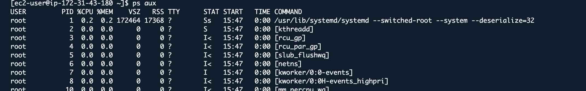
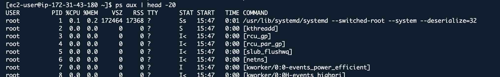
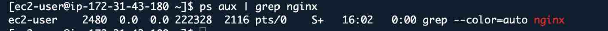
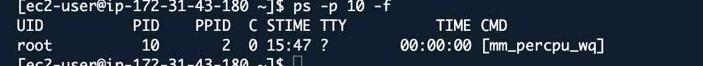
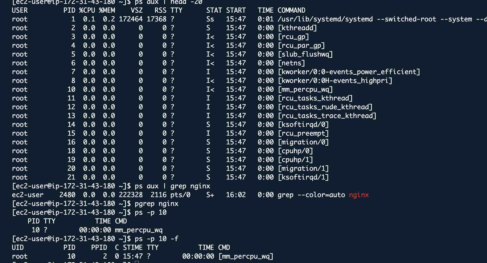
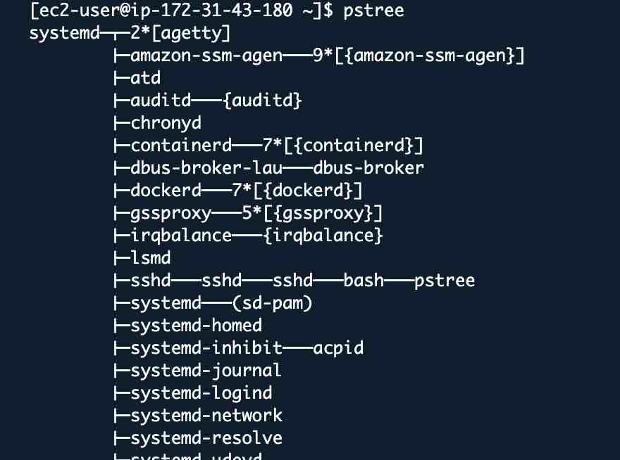
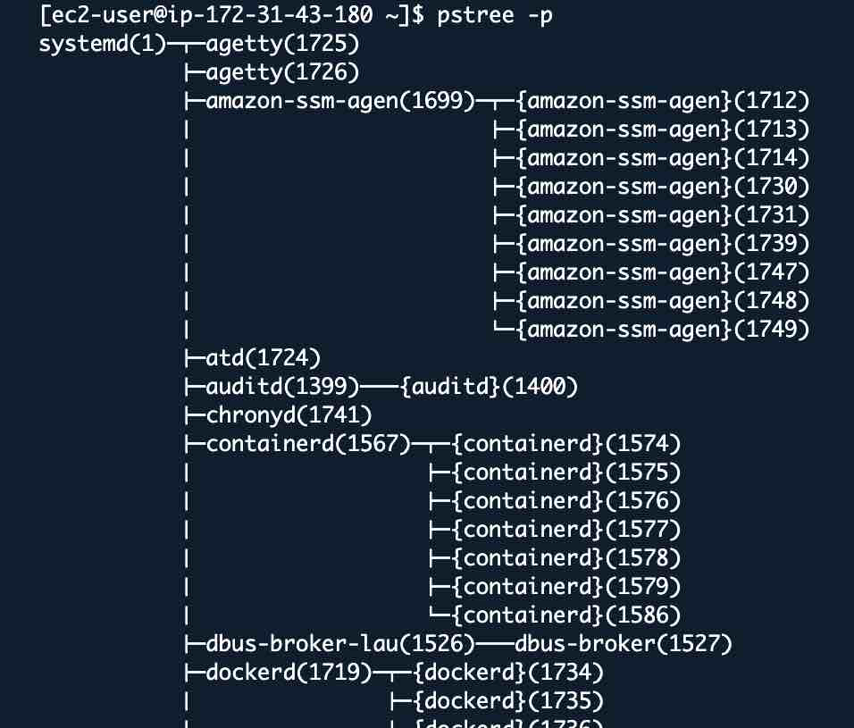
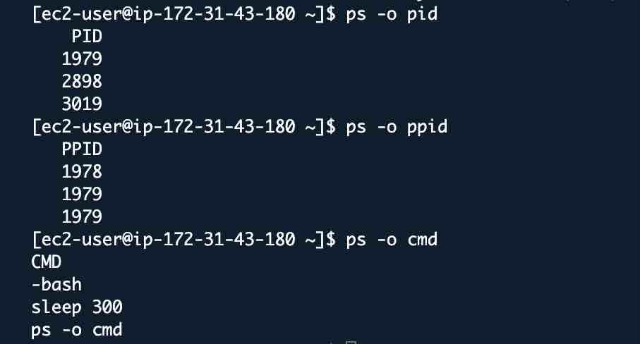
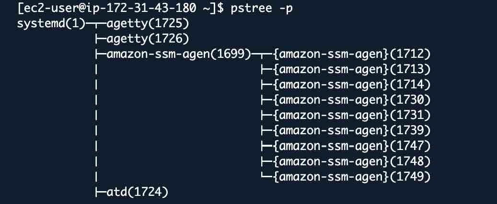

# Linux System Performance & Process Management - Complete Guide

## Lab Overview
**Platform:** Amazon Linux 202
**Duration:** 2-3 hours  
**Goal:** Master process management, CPU, memory, and I/O monitoring

---
### What is a Process?

A process is a running program. When you start an application, the OS creates a process for it.

**Every process has:**
- PID (Process ID) - Unique identifier
- Parent PID (PPID) - Who started this process
- User - Who owns the process
- State - Running, Sleeping, Stopped, Zombie
- Priority - How important it is
- Resources - CPU, Memory it's using

---
### View All Processes

```bash
# See all processes (snapshot)
ps aux
```



```bash
ps aux | head -20
```




### finding specific processes

```bash
ps aux | grep nginx
```


```bash
pgrep nginx
ps -p 10 -f
```



```bash
pstree
```


# process tree with parent id, every process has a parent and pid 1 is the init system(systemmd on linux)
```bash
pstree -p
```




**Key Concept** Kill a parent process all the children will die too. 

---
## Real time CPU Monitoring with top
