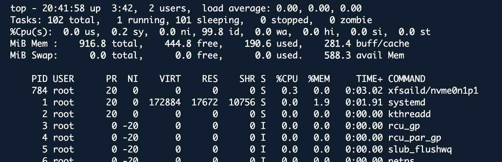
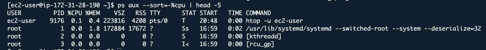
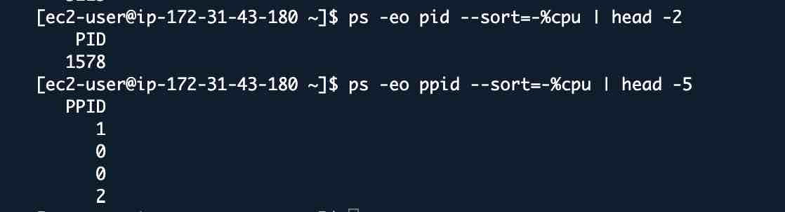
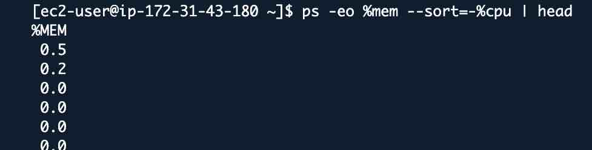
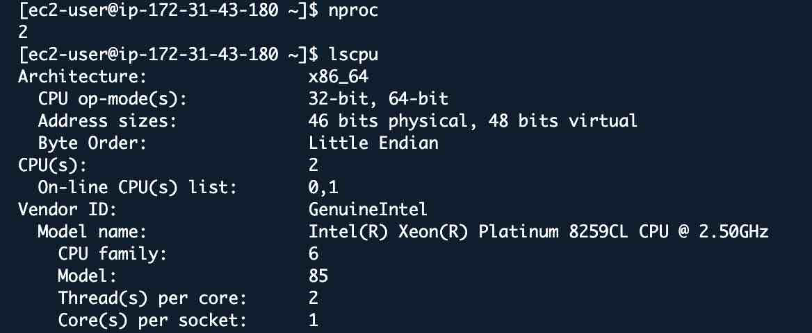
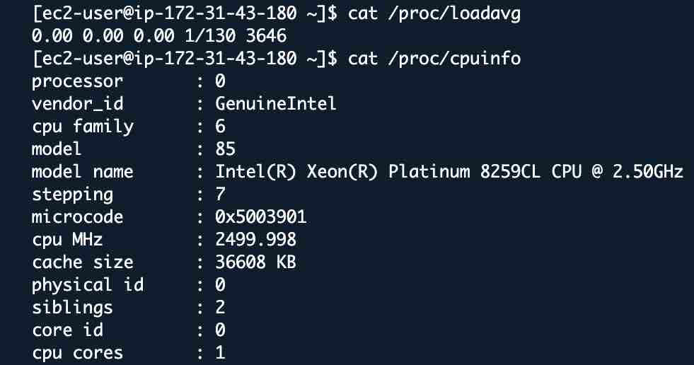
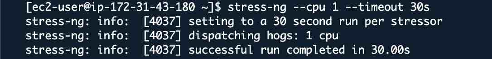
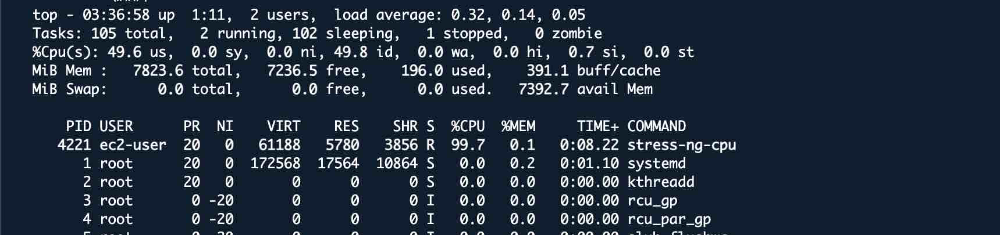
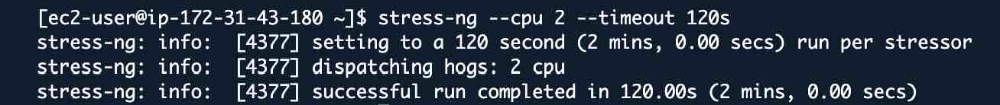

# Linux System Performance & Process Management - Complete Guide

## Lab Overview
**Platform:** Amazon Linux 202
**Duration:** 2-3 hours  
**Goal:** Master process management, CPU, memory, and I/O monitoring

---
### What is a Process?

A process is a running program. When you start an application, the OS creates a process for it.

**Every process has:**
- PID (Process ID) - Unique identifier
- Parent PID (PPID) - Who started this process
- User - Who owns the process
- State - Running, Sleeping, Stopped, Zombie
- Priority - How important it is
- Resources - CPU, Memory it's using

---
### View All Processes

```bash
# See all processes (snapshot)
ps aux
```


```bash
ps aux | head -20
```


### finding specific processes

```bash
ps aux | grep nginx
```


```bash
pgrep nginx
ps -p 10 -f
```


```bash
pstree
```


## Process tree with parent id ##
** Every process has a parent and pid 1 is the init system(systemmd on linux)
```bash
pstree -p
```


**Key Concept** Kill a parent process all the children will die too. 

---
## Real time CPU Monitoring with top
```bash
top
```


```bash
htop -u ec2-user
```


## Finding CPU hogs
```bash
# Top 4 CPU consumers
ps aux --sort=-%cpu | head -5
```


```bash
#continously monitor top cpu user
watch -n 1 'ps aux --sort=-%cpu | head'
ps -eo pid --sort=-%cpu | head -4
ps -eo %mem --sort=-%cpu | head
```




##Load Average
```bash
uptime
nproc
lscpu
```




## Generating CPU Load for Testing
** Excercise 1
```bash
stress-ng --cpu 1 --timeout 30s
```



**Excercise 2
```bash
# Terminal 1
stress-ng --cpu 2 --timeout 120s
# Terminal 2
uptime
```
** Terminal 1 output 

** Terminal 2 output

